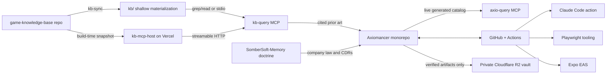

# External architecture

Axiomancer's game runtime and source live in this monorepo. The systems below sit outside it and support governance, research, automation, distribution, or evidence storage. None may silently become game-rules authority.

## Integration register

### Game knowledge base

- **Owner / location:** `no-trbl-2-u/game-knowledge-base`; canonical local sibling checkout: `/root/Workspace/SomberSoft/game-knowledge-base`.
- **Purpose:** source-backed board-game rules, reception research, reusable patterns, and the Dawncaster card/keyword corpus. It supplies external prior art; it does not own Axiomancer rules.
- **Materialization:** `node scripts/kb-sync.mjs` shallow-clones or hard-refreshes `origin/main` into this repo's gitignored `kb/` directory. `KB_REPO` and `KB_DIR` may override the defaults.
- **Direct data flow:** agents grep generated indexes/frontmatter first, read only selected documents, and preserve `kb:<game>/<document> (src-NNN)` evidence receipts.
- **MCP data flow:** `.mcp.json` launches `node scripts/kb-query-launcher.mjs` as the `kb-query` stdio server. The committed launcher exposes overview, search, document, game, card, and keyword lookups and picks its backend at start: the hosted `kb-mcp-host` endpoint when `KB_MCP_URL` is set, the canonical `kb/scripts/kb-mcp-server.mjs` when `kb/` is synced, or a recovery-message stub so the server always connects.
- **Availability:** development/research integration and optional accelerator. It is **not** a product-runtime dependency. If MCP is unavailable, use direct grep/read. If `kb/` is absent or stale, run `node scripts/kb-sync.mjs`.
- **Write path:** `node scripts/kb-sync.mjs wish "<coverage request>"` appends and best-effort pushes the KB wishlist. This requires write-capable ambient Git credentials or `GH_TOKEN`; a push failure must be reported but does not sink the design session.
- **Secrets:** `GH_TOKEN` may be loaded from the environment or an ignored `.env`. The sync script passes it as a per-command HTTP header and does not persist it in `kb/.git/config`.

### Hosted kb-query server (kb-mcp-host on Vercel)

- **Owner / location:** source in this repo at `kb-mcp-host/`; deployed as a Vercel project (team "TJ's projects") git-linked to this repo with root directory `kb-mcp-host`. The MCP endpoint is `POST /mcp` on the project domain.
- **Purpose:** makes `kb-query` a live server for sessions that have no synced `kb/` — remote interactive sessions and CI loop ticks — so prior-art lookups work at session start with zero materialization cost. Serves a build-time text snapshot of the corpus (`kb_overview` names the snapshot's commit and build time); it is read-only and owns no rules truth.
- **Data flow:** Vercel build runs `kb-mcp-host/build.mjs`, which shallow-clones the private KB repo and bundles ~8MB of corpus text into the function. Consumers reach it through `scripts/kb-query-launcher.mjs` when `KB_MCP_URL` is set (GitHub repo variable for CI, `.env` locally, environment config for remote sessions).
- **Freshness:** pushes to `kb-mcp-host/` redeploy automatically; `.github/workflows/kb-host-redeploy.yml` pokes the project's deploy hook nightly (secret `KB_HOST_DEPLOY_HOOK_URL`) so corpus-only KB pushes also land within a day.
- **Credentials:** Vercel project env `GH_TOKEN` (or `KB_GH_TOKEN`) with read access to the KB repo — required, the repo is private. `KB_MCP_TOKEN` (project env + consumer side) enables bearer auth on the endpoint; without it the snapshot is readable by anyone with the URL, so set it. Values live only in Vercel/GitHub settings and ignored `.env` files.
- **Availability / fallback:** optional accelerator under the failure law — if the host is down or unconfigured, the launcher falls back to the synced `kb/` stdio server, and grep/read on `kb/` always works.
- **Usage law:** stays within the Vercel free (hobby) tier; paid usage requires T's explicit approval.
- **Recovery:** `node --test kb-mcp-host/server.test.mjs` for the server logic; `node kb-mcp-host/serve.mjs` to run it locally against `corpus/` or `../kb`; a failed deploy leaves the previous deployment serving.

### MCP servers and tool boundaries

- **`kb-query`:** repo-configured stdio launcher (`scripts/kb-query-launcher.mjs`) over the **external** KB — hosted snapshot (`kb-mcp-host`) when `KB_MCP_URL` is set, else the corpus materialized in `kb/`. Optional accelerator; direct files remain the fallback.
- **`axio-query`:** repo-local stdio server at `scripts/axio-mcp-server.mjs`. It exposes current Axiomancer cards, enemies, effects, and keywords from `devlog/data/` plus `axiomancer-mechanics/docs/keyword-atlas.md`. It regenerates stale catalog data through `npm run catalog:export` when possible. It is not external data and never outranks mechanics source files.
- **`playwright`:** `.mcp.json` invokes `npx -y @playwright/mcp@latest` with isolated headless Chromium. This is development/test tooling, not runtime architecture. Native Playwright scripts remain available when MCP permissions or transport fail.
- **Failure law:** MCP improves retrieval and browser control but may not become the only route to evidence. Every MCP surface must retain a file, script, or CLI fallback.
- **Verification:** run `node scripts/axio-mcp-server.test.mjs` for the repo-local server. For KB recovery, sync first and then invoke the server through the configured MCP client.

### SomberSoft company doctrine and decisions

- **Owner / location:** remote `no-trbl-2-u/SomberSoft-Memory`; canonical local root `/root/Workspace/SomberSoft`.
- **Company law:** `/root/Workspace/SomberSoft/SOMBERSOFT_COMMAND_LEDGER.md`.
- **Company decision records:** `/root/Workspace/SomberSoft/decisions/`.
- **Repository decisions:** Axiomancer ADRs remain inside this monorepo under package or root `docs/adr/` paths.
- **Authority:** T's latest explicit decision wins. Company CDRs and the command ledger govern company-wide policy; repo ADRs govern repository architecture; live repo plans govern execution. External doctrine does not replace mechanics source as executable rules truth.
- **Availability:** required for major company-direction and cross-repository decisions, but not for compiling or running the game. If the sibling checkout is unavailable, stop decisions that depend on it rather than reconstructing doctrine from memory.
- **Secrets:** none belong in doctrine or decision records.

### GitHub and GitHub Actions

- **Owner / location:** `no-trbl-2-u/Axiomancer`; workflows are versioned in `.github/workflows/` and execute on GitHub-hosted runners.
- **Purpose:** repository hosting, issues/PRs, verification, autonomous Nexus commands, tuning/playtest jobs, dependency upkeep, and preview-build orchestration.
- **External actions and runtimes:** workflows use GitHub-maintained actions such as `actions/checkout@v4` and `actions/setup-node@v4`; Claude-powered jobs use `anthropics/claude-code-action@v1`; mobile preview builds invoke Expo's `eas-cli` service.
- **Credentials:** `GITHUB_TOKEN` is supplied by GitHub. `GH_PAT` is used when autonomous pushes must trigger downstream verification. `CLAUDE_CODE_OAUTH_TOKEN` authorizes Claude workflows. `EXPO_TOKEN` authorizes EAS preview builds. Optional notification integrations use `NOTIFY_NTFY_TOPIC` and `NOTIFY_WEBHOOK_URL`.
- **Secret boundary:** values live only in GitHub Actions secrets or ignored local environment files. Documentation and committed workflows name variables but never contain values.
- **Availability:** GitHub is required for hosted collaboration and CI, not for local engine execution. Claude workflows and notifications are automation layers; their failure must not redefine repository truth. EAS is required only for hosted preview builds.
- **Recovery:** run package verification locally (`npm run verify`) when hosted CI is unavailable. Use `gh auth status` and repository workflow logs to diagnose hosted failures; do not treat an absent cloud run as a passing deploy gate.

### Claude and browser automation

- **Claude Code action:** the reusable `.github/workflows/_claude-skill.yml` provisions Node 22, workspace dependencies, optional Playwright Chromium, ignored `.env` GitHub context, and Nexus guard self-tests before invoking Claude. These workers operate on repository state but their self-reports are not proof; commits, CI, tests, and artifacts are proof.
- **Local Judge/Sol work:** direct implementation is permitted. Delegation is optional and should be used only when parallelism or independent review adds value.
- **Playwright:** browser automation may run through MCP or package scripts. It provides visual/runtime evidence, never mechanics authority.

### Expo EAS

- **Owner / location:** Expo-hosted EAS; configuration lives in `axiomancer-mobile/`.
- **Purpose:** hosted Android/iOS preview builds after the mobile verification gate.
- **Data flow:** `.github/workflows/preview-build.yml` verifies mobile, optionally runs visual smoke, then calls `npx eas-cli@latest build` with `EXPO_TOKEN`.
- **Availability:** preview/distribution only; not required for local Expo development or mechanics execution.
- **Failure behavior:** a failed or absent EAS build blocks claiming a hosted preview, but does not erase local verification evidence.

### Private Cloudflare R2 artifact vault

- **Owner / location:** private bucket `sombersoft-artifacts`; client and operating documentation live outside this repo at `/root/Workspace/SomberSoft/artifact-vault/` in SomberSoft-Memory.
- **Purpose:** durable storage for verified playtest evidence, screenshots, reports, and build artifacts. It is not a source-code mirror, database, game runtime dependency, or public CDN.
- **Key contract:** `project/kind/YYYY-MM-DD/run/filename`; uploads include SHA-256 metadata and a manifest sidecar.
- **Data flow:** a local or CI producer invokes the sibling CLI after verification; R2 stores the artifact privately; consumers list, inspect, and download by canonical key. Public bucket access is forbidden.
- **Credentials:** Cloudflare/R2 credentials remain outside this repo, locally in `/root/.config/sombersoft/cloudflare-r2.env` or in appropriately scoped CI secrets. Never copy credential values into Axiomancer files, logs, prompts, manifests, or commits.
- **Usage law:** Cloudflare must remain within the free tier. Any paid usage requires T's explicit approval. Keep Standard storage, monitor monthly storage and operation counts, and do not add automatic bulk uploads or retention expansion without a bounded estimate and guardrail.
- **Availability:** optional artifact storage. An R2 outage blocks archival claims but must not block local development, tests, or access to source-controlled evidence.
- **Recovery / use:** from `/root/Workspace/SomberSoft`, load the protected environment, set `R2_BUCKET=sombersoft-artifacts`, and use `node artifact-vault/bin/artifact-vault.js help`. Do not add a repository-relative dependency on the sibling CLI.

## Architecture rules

1. **No external service owns game rules.** `axiomancer-mechanics` source and tests remain executable authority.
2. **Accelerators require fallbacks.** MCP and hosted agents may accelerate work but cannot become the sole evidence path.
3. **External writes are explicit.** KB wishlist pushes, GitHub mutations, EAS builds, and R2 uploads must identify their destination and verification evidence.
4. **Secrets never cross into Git.** Commit variable names and recovery procedures, never values.
5. **Artifacts are not source truth.** R2 preserves evidence; Git preserves source and durable repository decisions.
6. **Failure is labeled by boundary.** Distinguish local product failure from unavailable KB, MCP, GitHub, Claude, Expo, notification, or R2 infrastructure.
7. **New external architecture updates this document.** Any new hosted service, sibling repository, MCP server, external datastore, or required agent runtime must be added here with owner, authority, credentials, fallback, and recovery procedure.
